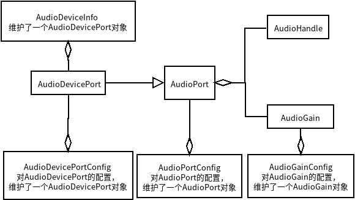

# AudioDeviceInfo阅读理解  

>Author: 刘金龙&#160;&#160;&#160;&#160;&#160;&#160;&#160;Date: 2020.05.11

## AudioDeviceInfo类描述

1. AudioDeviceInfo类的创建  

    ```java
    private final AudioDevicePort mPort;

    AudioDeviceInfo(AudioDevicePort port) {
       mPort = port;
    }
    ```

    1). AudioDeviceInfo创建时，需要传入`AudioDevicePort`对象，AudioDeviceInfo的整体描述，都是围绕`AudioDevicePort`展开的。  
    2). 可以得到的设备描述包括：设备标识符(AudioHandle)、产品名称、AudioPort地址、AudioPort角色(Source or Sink)、采样率、通道掩码(位置)、索引通道掩码、通道数量(双声道...)、编码(Encoding)、设备类型等。

2. AudioDeviceInfo是对Audio Device的描述，类中定义了设备类型  

    ```java
    /**
     * A device type associated with an unknown or uninitialized device.
     */
    public static final int TYPE_UNKNOWN          = 0;
    /**
     * A device type describing the attached earphone speaker.
     */
    public static final int TYPE_BUILTIN_EARPIECE = 1;

    ........

    /**
     * A type-agnostic device used for communication with external audio systems
     */
    public static final int TYPE_BUS              = 21;
    /**
     * A device type describing a USB audio headset.
     */
    public static final int TYPE_USB_HEADSET       = 22;
    ```

    > Note: // TODO  need to supply， 设备类型与什么的对应关系？  

    AudioDeviceInfo还有一点比较重要的是，它定义了设备类型的对应关系

    ```java
    private static final SparseIntArray INT_TO_EXT_DEVICE_MAPPING;

    private static final SparseIntArray EXT_TO_INT_DEVICE_MAPPING;

    static {
        INT_TO_EXT_DEVICE_MAPPING = new SparseIntArray();
        INT_TO_EXT_DEVICE_MAPPING.put(AudioSystem.DEVICE_OUT_EARPIECE, TYPE_BUILTIN_EARPIECE);
        INT_TO_EXT_DEVICE_MAPPING.put(AudioSystem.DEVICE_OUT_SPEAKER, TYPE_BUILTIN_SPEAKER);
        INT_TO_EXT_DEVICE_MAPPING.put(AudioSystem.DEVICE_OUT_WIRED_HEADSET, TYPE_WIRED_HEADSET);

        ......

        EXT_TO_INT_DEVICE_MAPPING.put(TYPE_BUS, AudioSystem.DEVICE_OUT_BUS);
    }
    ```

## AudioDevicePort类描述(`AudioDeviceInfo`的构建对象)

### AudioPort类描述(`AudioDevicePort`继承自`AudioPort`)

1. 类的含义：`AudioPort`是对"音频节点"的抽象，该对象由framework创建，是一个隐藏类；`AudioPort`包含了对"音频节点"所支持的各种属性的描述：角色(Source or Sink)、名称、采样率(Sample)、通道掩码(Channel position mask)、索引通道掩码(Channel index mask)、编码(Encoding)、音频增益(Audio Gain)。

    > 该`AudioPort`可支持多种采样率、通道掩码设置、编码、音频增益。  
    >
    >- `AudioPort`维护了一个`AudioHandle`对象和一个`AudioGain`数组，AudioHandle为该Audio Port的唯一标识符，AudioGain数组为Audio Port所支持的音频增益
    >- `AudioPort`类中还包含创建`AudioPortConfig`的操作，该类的结构与`AudioGain`非常类似

2. 类的构建

    ```java
    AudioPort(AudioHandle handle, int role, String name,
            int[] samplingRates, int[] channelMasks, int[] channelIndexMasks,
            int[] formats, AudioGain[] gains) {

        // Audio Port 唯一标识符
        mHandle = handle;
        mRole = role;
        mName = name;
        mSamplingRates = samplingRates;
        mChannelMasks = channelMasks;
        mChannelIndexMasks = channelIndexMasks;
        mFormats = formats;
        mGains = gains;
    }
    ```

3. 与AudioPort相关的类，`AudioHandle`、`AudioPortConfig`、`AudioGain`，在下面研究。

### AudioHandle类描述(`AudioPort`中维护了一个`AudioHandle`对象)

1. 类的含义：唯一标识符

    >The AudioHandle is used by the audio framework implementation to uniquely identify a particular component of the routing topology(AudioPort or AudioPatch)  

2. 类的属性、构建：只有一个int型的变量`id`作为唯一标识符

   ```java
    AudioHandle(int id) {
        mId = id;
    }
   ```

### AudioGain类描述(`AduioPort`中维护了一个`AudioGain`对象)

1. 类的含义：增益控制器；指定音频端口的增益控制器，是对该音频端口增益控制的抽象

    > The AudioGain describes a gain controller. Gain controllers are exposed by audio ports when the gain is configurable at this port's input or output. Gain values are expressed in millibels.
    >> Note：`AudioGain`源码的类描述非常清晰

2. 类的属性：对Channel的控制方式、Channel的使能、增益最小值、增益最大值、增益默认值、增益步进值、爬坡增益最小时间段、爬坡增益最大时间段。

    >  A gain controller has the following attributes:
    >
    >- mode: defines modes of operation or features  
        MODE_JOINT: all channel gains are controlled simultaneously  
        MODE_CHANNELS: each channel gain is controlled individually  
        MODE_RAMP: ramps can be applied when gain changes  
    >- channel mask: indicates for which channels the gain can be controlled
    >- min value: minimum gain value in millibel
    >- max value: maximum gain value in millibel
    >- default value: gain value after reset in millibel
    >- step value: granularity of gain control in millibel
    >- min ramp duration: minimum ramp duration in milliseconds
    >- max ramp duration: maximum ramp duration in milliseconds

3. 类的构建：`AudioGain`的创建增加了属性`index`, 该属性应用于`AudioGainConfig`  

    ```java
    // The channel mask passed to the constructor is as specified in AudioFormat
    // (e.g. AudioFormat.CHANNEL_OUT_STEREO)
    AudioGain(int index, int mode, int channelMask,
                        int minValue, int maxValue, int defaultValue, int stepValue,
                        int rampDurationMinMs, int rampDurationMaxMs) {
        mIndex = index;
        mMode = mode;
        mChannelMask = channelMask;
        mMinValue = minValue;
        mMaxValue = maxValue;
        mDefaultValue = defaultValue;
        mStepValue = stepValue;
        mRampDurationMinMs = rampDurationMinMs;
        mRampDurationMaxMs = rampDurationMaxMs;
    }
    ```

4. 与AudioGain相关的类`AudioGainConfig`，在后面研究(暂不研究)  

### AudioDevicePort类描述(维护了一个`AudioHandle`对象和一个`AudioGain`数组)  

1. 类的含义：`AudioDevicePort`是`AudioPort`的子类，是特殊的audio port，是对AudioPort的进一步抽象。

    > The AudioDevicePort is a specialized type of AudioPort describing an input (e.g microphone) or output device (e.g speaker) of the system.

2. 类的属性：增加了`type`和`address`属性

    > In addition to base audio port attributes, the device descriptor contains:
    >
    >- the device type (e.g AudioManager.DEVICE_OUT_SPEAKER)
    >- the device address (e.g MAC adddress for AD2P sink).
    >
    >> 关于`address`的描述，在源码中说明的非常清晰

3. 与`AudioDevicePort`相关的类是`AudioDevicePortConfig`，`AudioDevicePort`中含有`buildConfig`方法，类的结构与`AudioGain`和`AudioPort`非常类似

## AudioDeviceInfo与上面各类之间的关系描述


