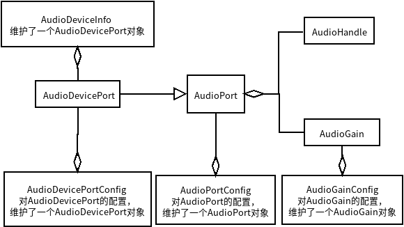

# AudioRecord 相关类  

// TODO 需要重新组织下面的类，理清对应的框架

1. AudioRecord

2. AudioAttributes  

3. AudioDeviceInfo、AudioDevicePort、AudioDevicePortConfig、AudioPort、AudioPortConfig、AudioGain、AudioGainConfig、AudioHandle类之间的关系

4. AudioFormat  
AudioFormat是对Audio Frame格式的抽象，相关概念Sample Rate、Encoding、Channel Mask、Audio Frame.

5. AudioRouting  

6. AudioSystem  

7. AudioManager  

8. AudioTimeStamp  

9. IAudioService  

10. AudioMixPort  
