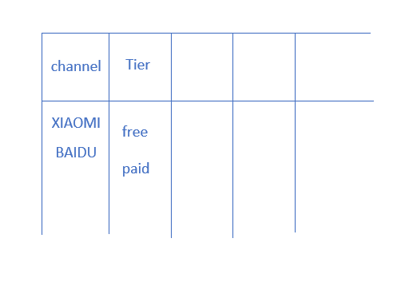

# Tuning中涉及的gradle的相关内容

>Author: Aiden&#160;&#160;&#160;&#160;&#160;&#160;&#160;Date: 2020.07.15

## 文档地址

1. 官方文档地址[Gradle Overview](https://developer.android.google.cn/studio/build#settings-file)

## 项目相关内容

下面是一个Module中`build.gradle`的配置案例

```gradle
apply plugin: 'com.android.application'

android {

  compileSdkVersion 28
  buildToolsVersion "29.0.2"

  
  defaultConfig {
    ......
  }

  buildTypes {

    debug {
        ......
    }

    release {
        ......
    }
  }

  flavorDimensions "channel"
  productFlavors {
    XIAOMI {
      ......
    }

    BAIDU {
      ......
    }
  }

  splits {
    density {
      ......
    }
  }
}

dependencies {
    ......
}
```

### 多版本管理

1. 项目根目录下`build.gradle`定义

    ```gradle
    buildscript {
        ext {
            // compile
            compile_sdk_version = 29
            build_tools_version = "29.0.3"
            min_sdk_version = 19
            target_sdk_version = 29

            // dependencies
            kotlin_version = "1.3.72"
            gradle_version = "4.0.0"
            core_ktx_version = "1.3.0"
            appcompat_version = "1.1.0"
            constraintlayout_version = "1.1.3"
            junit_version = "4.13"
            ext_junit_version = "1.1.1"
            espresso_core_version = "3.2.0"

            // sharedUserId
            system = "android.uid.system"
            package_name = "com.mk.test"
        }

        repositories {...}

        dependencies {...}
    }
    ```

2. `Module`中`build.gradle`中使用

    ```gradle
    android {
        compileSdkVersion rootProject.ext.compile_sdk_version
        buildToolsVersion rootProject.ext.build_tools_version
    }

    dependencies {
        implementation fileTree(dir: "libs", include: ["*.jar"])
        implementation "org.jetbrains.kotlin:kotlin-stdlib:${rootProject.ext.kotlin_version}"
        implementation "androidx.core:core-ktx:${rootProject.ext.core_ktx_version}"
        implementation "androidx.appcompat:appcompat:${rootProject.ext.appcompat_version}"
        implementation "androidx.constraintlayout:constraintlayout:${rootProject.ext.constraintlayout_version}"
        testImplementation "junit:junit:${rootProject.ext.junit_version}"
        androidTestImplementation "androidx.test.ext:junit:${rootProject.ext.ext_junit_version}"
        androidTestImplementation "androidx.test.espresso:espresso-core:${rootProject.ext.espresso_core_version}"
    }
    ```

### 多渠道配置

1. 实现多渠道配置基本配置

    ```gradle
    android {

        compileSdkVersion 28
        buildToolsVersion "29.0.2"  
        defaultConfig {...}
        buildTypes {
            debug {...}
            release {...}
        }

        /* 不同搭配begin */
        flavorDimensions "channel"
        productFlavors {
            XIAOMI {
                dimension "channel"
            }

            BAIDU {
                dimension "channel"
            }
        }
        /*end*/

        splits {
            density {...}
        }
    }

    dependencies {...}
    ```

2. 实现不同渠道APP的配置，首先需要添加`flavorDimensions`(风味维度)

    ```gradle
    flavorDimensions "channel" "tier"
    ```

    上面添加了两个维度`channel`和`tier`; 对于小米和百度上的APK来说，两者属于同一维度`channel`; 对于付费和免费来说，两者属于同一维度`tier`.

3. 上面第2点定义了`flavorDimensions`(风味维度)，后面需要根据调味的维度定义不同风味的APK（像做菜一样）

    ```gradle
    flavorDimensions "channel" "tier"
        productFlavors {
            XIAOMI {
                dimension "channel"
            }

            BAIDU {
                dimension "channel"
            }

            free {
                dimesion "tier"
            }

            paid {
                dimesion "tier"
            }
        }
    ```

    上面定义属于`channel`的两个产品和属于`tier`的两个产品  
    > Note: 如果定义了`flavorDiemsions`而没有使用，是错误的。

    

4. 定义好产品之后，就可以针对不同的`productFlavor`进行配置，其配置将覆盖`defaultConfig`

    ```gradle
    flavorDimensions "channel"
    // 多渠道定义
    productFlavors {

        XIAOMI {
            dimension "channel"
            // 定义manifest内的变量
            manifestPlaceholders = [
                    channel:"XIAOMI",
                    sharedUserId:"${rootProject.ext.package_name}"
            ]
        }
    }
    ```

    ```xml
    <!-- 渠道信息 -->
    <meta-data android:name="APP_CHANNEL" android:value="${channel}"/>
    ```

5. 覆盖`defaultConfig`的配置详细见官方文档[Configure build variants](https://developer.android.google.cn/studio/build/build-variants#product-flavors)

### Jar包的编译  

### 完整案例

```gradle
/**
 * The first line in the build configuration applies the Android plugin for
 * Gradle to this build and makes the android block available to specify
 * Android-specific build options.
 */

apply plugin: 'com.android.application'

/**
 * The android block is where you configure all your Android-specific
 * build options.
 */

android {

  /**
   * compileSdkVersion specifies the Android API level Gradle should use to
   * compile your app. This means your app can use the API features included in
   * this API level and lower.
   */

  compileSdkVersion 28

  /**
   * buildToolsVersion specifies the version of the SDK build tools, command-line
   * utilities, and compiler that Gradle should use to build your app. You need to
   * download the build tools using the SDK Manager.
   *
   * This property is optional because the plugin uses a recommended version of
   * the build tools by default.
   */

  buildToolsVersion "29.0.2"

  /**
   * The defaultConfig block encapsulates default settings and entries for all
   * build variants, and can override some attributes in main/AndroidManifest.xml
   * dynamically from the build system. You can configure product flavors to override
   * these values for different versions of your app.
   */

  defaultConfig {

    /**
     * applicationId uniquely identifies the package for publishing.
     * However, your source code should still reference the package name
     * defined by the package attribute in the main/AndroidManifest.xml file.
     */

    applicationId 'com.example.myapp'

    // Defines the minimum API level required to run the app.
    minSdkVersion 15

    // Specifies the API level used to test the app.
    targetSdkVersion 28

    // Defines the version number of your app.
    versionCode 1

    // Defines a user-friendly version name for your app.
    versionName "1.0"
  }

  /**
   * The buildTypes block is where you can configure multiple build types.
   * By default, the build system defines two build types: debug and release. The
   * debug build type is not explicitly shown in the default build configuration,
   * but it includes debugging tools and is signed with the debug key. The release
   * build type applies Proguard settings and is not signed by default.
   */

  buildTypes {

    /**
     * By default, Android Studio configures the release build type to enable code
     * shrinking, using minifyEnabled, and specifies the default Proguard rules file.
     */

    release {
        minifyEnabled true // Enables code shrinking for the release build type.
        proguardFiles getDefaultProguardFile('proguard-android.txt'), 'proguard-rules.pro'
    }
  }

  /**
   * The productFlavors block is where you can configure multiple product flavors.
   * This allows you to create different versions of your app that can
   * override the defaultConfig block with their own settings. Product flavors
   * are optional, and the build system does not create them by default.
   *
   * This example creates a free and paid product flavor. Each product flavor
   * then specifies its own application ID, so that they can exist on the Google
   * Play Store, or an Android device, simultaneously.
   *
   * If you declare product flavors, you must also declare flavor dimensions
   * and assign each flavor to a flavor dimension.
   */

  flavorDimensions "tier"
  productFlavors {
    free {
      dimension "tier"
      applicationId 'com.example.myapp.free'
    }

    paid {
      dimension "tier"
      applicationId 'com.example.myapp.paid'
    }
  }

  /**
   * The splits block is where you can configure different APK builds that
   * each contain only code and resources for a supported screen density or
   * ABI. You'll also need to configure your build so that each APK has a
   * different versionCode.
   */

  splits {
    // Settings to build multiple APKs based on screen density.
    density {

      // Enable or disable building multiple APKs.
      enable false

      // Exclude these densities when building multiple APKs.
      exclude "ldpi", "tvdpi", "xxxhdpi", "400dpi", "560dpi"
    }
  }
}

/**
 * The dependencies block in the module-level build configuration file
 * specifies dependencies required to build only the module itself.
 * To learn more, go to Add build dependencies.
 */

dependencies {
    implementation project(":lib")
    implementation 'com.android.support:appcompat-v7:28.0.0'
    implementation fileTree(dir: 'libs', include: ['*.jar'])
}
```
